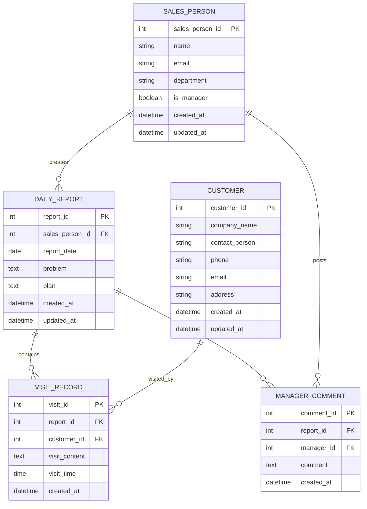

```mermaid
erDiagram
    SALES_PERSON ||--o{ DAILY_REPORT : creates
    DAILY_REPORT ||--o{ VISIT_RECORD : contains
    CUSTOMER ||--o{ VISIT_RECORD : visited_by
    DAILY_REPORT ||--o{ MANAGER_COMMENT : receives
    SALES_PERSON ||--o{ MANAGER_COMMENT : posts

    SALES_PERSON {
        int sales_person_id PK
        string name
        string email
        string department
        boolean is_manager
        datetime created_at
        datetime updated_at
    }

    CUSTOMER {
        int customer_id PK
        string company_name
        string contact_person
        string phone
        string email
        string address
        datetime created_at
        datetime updated_at
    }

    DAILY_REPORT {
        int report_id PK
        int sales_person_id FK
        date report_date
        text problem
        text plan
        datetime created_at
        datetime updated_at
    }

    VISIT_RECORD {
        int visit_id PK
        int report_id FK
        int customer_id FK
        text visit_content
        time visit_time
        datetime created_at
    }

    MANAGER_COMMENT {
        int comment_id PK
        int report_id FK
        int manager_id FK
        text comment
        datetime created_at
    }
```
